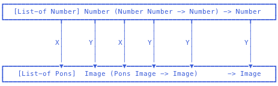

# 如何设计程序

## A程序设计食谱

> 程序分为两类
> 
> + 批处理程序 batch program
> + 交互式程序 world program.

### 数据定义

#### 1.概论

关键在于为**现实世界的信息**找到精确的**数据模型**，以及能恰当地操作它们的**函数**。复杂的现实问题将在找到合适的数据模型和函数时经历循序渐进的过程。数据模型设计过程从(精)简到繁，有时程序员必须在程序发布后根据客户的需求改善数据模型。要善于在数据定义中发现**自引用类型**。

#### 2.寻找数据模型

* 程序语言提供： 数，字符串，布林值，图像
* 数据模型设计：结构体，数组，链表
* 函数作为数据：**函数即值**

#### 3.确定环境常量 和 变量

#### 4.Intervals, enumeration, Itemization, Strucrure

> 由于信息中各类的差异而需要Itemization,出于合并不同类的信息而需要结构体类。Interval对应于Number，Enum对应于Object。

### 函数定义

#### 1.愿望清单：控制函数及其组成成份的设计过程的关键。

``` lisp
;a signature, a purpose statement, a header
;Number -> Number
;computes the area of a square whose side is length
(define (aera-of-square length) 0)
; test and example
(check-expect (f2c -40) -40)
(check-expect (f2c 32) 0)
(check-expect (f2c 212) 100)
```

#### 2.Define one function per task

###### 	小的函数更容易设计，目的更清晰，合并过程更简明

#### 3.函数的组织映射到数据定义上

- condition >> interval, enum, itemization
- recursive >> self-reference: list, number
- selector   >> structure data

#### 4.使用built-in函数编写新的函数

> program designers plan ahead and design the function **to the output** that available function deliver.

#### 5.Design one template per data definition

> 当数据模型引用到自身或另一类数据模型时，编写针对此类数据的辅助函数。

#### 6.当设计食谱失效时，设计一个针对现实问题**更加一般的函数**，然后将main函数作为一般函数的特殊应用。

************************************************************

## 程序设计重构

### 抽象

> In essence, to abstact is to turn something concrete into a parameter.

#### 抽象设计

- **Don't Repeat Yourself!**
  
  > 优秀的程序员会发现程序中重复的代码并设计新的抽象。
  > 
  > 1. 从相似的函数结构上入手，找出相似函数间不同的地方，并将其作为抽象函数的一个新参数。
  >    
  > 2. 从相似函数的签名上入手：
  >    
  >     
  >    
  >    得出新的抽象函数的签名为：
  >    
  >    ``` lisp
  >    [List-of X] Y (X Y -> Y) -> Y
  >    ```
  
- **Single Point Control**
  
  * 抽象在数据上的应用
    
    集中环境常量，避免重复和神奇数字以及方便修改。
    
  * 抽象在函数上的应用
    
    将一些函数的功能定义放在一个抽象函数中，简化定义，方便程序的管理，如更正错误或修改程序的一个参数的类型。
  
- **Creating Abstraction**
  
  > Form an abstraction instead of copying and modifying any piece of a program.
  
- **Lambda**
  
  ``` lisp
  (local (...sequence of definitions...) (body-expression))
  ```
  
  在设计函数时使用local的目的：
  
  * 设计辅助函数，在注释中写出其签名、目的和眉头
  * 在body-expression中写出将使用的抽象函数
  * local内的辅助函数不仅能使用函数的参数及全局常量，也能使用local内周边函数的参数
  
  ``` lisp
  (lambda (variable-1 ... variable-N) expression)
  ```
  
  事实上，lambda创造一个函数，define为它取名。

### 递归

#### Structual Recursive

> 此概念出自本书。针对链表list，数Number等自引用的数据类型的一种递归函数。

#### 算法设计食谱 Generative Recursive

1. 将问题信息呈现为所选语言的数据
   
2. 函数签名，目的说明，函数眉头
   
3. **举例说明如何实现**
   
4. 设计算法的一般模版
   
   > 算法设计区分两种子问题：
   > 
   > 对于不可直接求解的子问题，采用递归的方式来求解
   > 
   > 最后结合所有子问题的解求得原问题的解
   
5. 将算法定义为函数
   
   * **对于原问题**，何种规模的子问题是可以直接求解的？
   * **如何**求解**可直接求解的子问题** 的？
   * 算法是**如何**产生较容易求解的子问题的？一个还是多个？
   * 原问题的解和子问题的解是否一样？还是需要结合子解来求得原解？如果是，需要用到原问题中的哪些数据吗？
   
6. 测试
   
7. 增加终止条件
   
   是否每一次迭代中产生的子问题的数据规模比迭代所接受的问题数据规模小，并举例何时算法函数会终止。

#### 累加器

>  针对**语境丢失**的情况，增加一个参数来代表调用函数的语境。在遍历数据的过程中，迭代调用持续接受新的参数，累加器随其它参数以及每次调用函数的语境的变化而变化。

### 数据结构

#### 二叉树和二叉搜索树

``` lisp
(define-struct no-info [])
(define NONE (make-no-info))
(define struct node [ssn name left right])

;A BinaryTree (BT) is one of:
;- NONE
;- (make-node Number Symbol BT BT)

; A Binary Search Tree (BST)
; is a BT according to following conditions:
; NONE is always a BST
; (make-node ssn0 name0 L R) is a BST if
; - L is a BST
; - R is a BST
; - all fields in L contain numbers that are smaller than ssn0
; - all fields in R contain numbers that are larger than ssn0
```

### 排序算法

#### 插入排序 INSERTION-SORT

``` lisp
;[List-of Number] [Number Number -> Boolean] -> [List-of Number]
(define (sort-cmp alon0 cmp)
  (local (;[List-of Number] -> [List-of Number]
   	      ;produces a sorted version of alon sorted by cmp
          (define (isort alon)
            (cond
              [(empty? alon) '()]
              [(cons? alon) (insert (first alon) 
                                   (isort (rest alon)))]))
          ;Number [List-of Number] -> [List-of Number]
          ;inserts n into the sorted list of numbers alon
          (define (insert n alon)
            (cond
              [(empty? alon) (cons n '())]
              [else (if (cmp n (first alon))
                        (cons n alon)
                        (cons (first alon) 
                              (insert n (rest alon))))])))
   (isort alon0)))
```

#### 快速排序 QUICK-SORT

``` lisp
; [List-of Number] -> [List-of Number]
; creates a list of numbers with the numbers as
; alon, sorted in ascending order
; assume the numbers are all distinct
(define (quick-sort alon)
  (cond
    [(empty? alon) '()]
    [else (local ((define pivot (first alon)))
             (append (quick-sort (smaller-items alon pivot))
                     (list pivot)
                     (quick-sort (larger-items alon pivot))))]))
; [List-of Number] Number -> [List-of Number]
; creates a list with all those numbers on alon
; that are larger than n
(define (larger-items alon n)
  (cond 
    [(empty? alon) '()]
    [else (if (> (first alon) n)
              (cons (first alon) (large-items (rest alon) n))
              (larger-items (rest alon) n))]))
; [List-of Number] Number -> [List-of Number]
; creates a list with all those numbers on alon
; that are smaller than n
(define (smaller-items alon n)
  (cond 
    [(empty? alon) '()]
    [else (if (< (first alon) n)
              (cons (first alon) (smaller-items (rest alon) n))
              (smaller-items (rest alon) n))]))
```